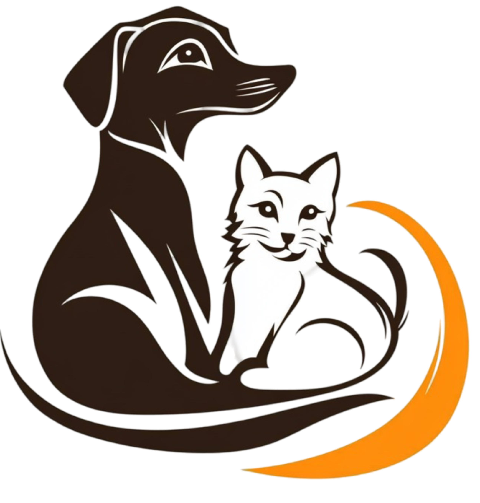

<p align="center">
  
</p>

<h1 align="center">🐾 Blog de Mascotas</h1>
<p align="center">
  Plataforma de blog enfocada en <strong>mascotas, cuidado animal y comunidad pet-friendly</strong>, desarrollada en <strong>Django</strong> con un diseño moderno y minimalista.
</p>

<p align="center">
  <a href="#🚀-características">✨ Características</a> | 
  <a href="#🛠️-tecnologías-utilizadas">🛠️ Tecnologías</a> | 
  <a href="#📂-estructura-del-proyecto">📂 Estructura</a> |
  <a href="#🚀-instalación-y-uso">🚀 Instalación</a> |
  <a href="#🤝-contribución">🤝 Contribución</a>
</p>

---

## 🚀 Características

- 📝 **Publicación y gestión de artículos**: Crea, edita y elimina artículos sobre mascotas organizados por categorías.
- 🖼️ **Imágenes destacadas y galería**: Sube imágenes para cada artículo con soporte para banners y galerías.
- 💬 **Sistema de comentarios**: Permite a los usuarios comentar en los artículos con soporte para reacciones.
- 🔒 **Autenticación de usuarios**: Registro, inicio de sesión y perfiles personalizables con avatares.
- 🌐 **Diseño responsive**: Interfaz moderna y adaptable a dispositivos móviles usando TailwindCSS.
- ⭐ **Sistema de visitas**: Rastrea el número de visitas por artículo.
- 📅 **Fechas de publicación**: Gestión automática de fechas de creación y modificación.
- 🛡️ **Permisos de edición**: Solo autores, staff o superusuarios pueden editar artículos.
- 📧 **Notificaciones**: Sistema de mensajes integrado para feedback al usuario.  

---

## 🛠️ Tecnologías utilizadas

<p align="center">
  
  
  
  
  
</p>

### Backend
- **Django 5.2.8**: Framework web principal para el desarrollo backend.
- **Python 3.12.6**: Lenguaje de programación.
- **SQLite**: Base de datos utilizada en desarrollo.

### Frontend
- **HTML5**: Estructura de las páginas.
- **TailwindCSS**: Framework CSS para estilos modernos y responsive.
- **JavaScript**: Interacciones del lado cliente.

### Librerías y Herramientas
- **Django CKEditor 5**: Editor de texto enriquecido para contenido de artículos.
- **Pillow**: Procesamiento de imágenes.
- **Django Widget Tweaks**: Personalización de formularios.
- **Django Extensions**: Herramientas adicionales para desarrollo.
- **python-dotenv**: Gestión de variables de entorno.  

---

##  Usuarios de prueba

**ADMIN**  
- Usuario: `claudio00`  
- Contraseña: `tomadin1234`  

**USUARIO REGULAR Y SUPERUSUARIO**  
- Usuario: `Nico80`  
- Contraseña: `Banco203040?`  

> 💡 Se han cargado posts de prueba sobre mascotas.

---

## 🧪 Pruebas

Para ejecutar las pruebas del proyecto:

```bash
cd blog
python manage.py test
```

---

## 🚀 Despliegue

### Producción

1. Configura las variables de entorno para producción en `.env`:
   ```
   DJANGO_ENV=production
   SECRET_KEY=tu_clave_secreta_segura
   ```

2. Ejecuta las migraciones y recolecta archivos estáticos:
   ```bash
   python manage.py migrate
   python manage.py collectstatic --noinput
   ```

3. Usa un servidor WSGI como Gunicorn para producción:
   ```bash
   pip install gunicorn
   gunicorn blog.wsgi:application --bind 0.0.0.0:8000
   ```

### Docker (opcional)

Si deseas usar Docker, crea un `Dockerfile` y `docker-compose.yml` (no incluidos en este repositorio).

---

## 🤝 Contribución

¡Las contribuciones son bienvenidas! Para contribuir:

1. Haz un fork del proyecto
2. Crea una rama para tu feature (`git checkout -b feature/nueva-funcionalidad`)
3. Commit tus cambios (`git commit -am 'Agrega nueva funcionalidad'`)
4. Push a la rama (`git push origin feature/nueva-funcionalidad`)
5. Abre un Pull Request

### Guías de contribución
- Sigue las convenciones de código de Django
- Escribe pruebas para nuevas funcionalidades
- Actualiza la documentación según sea necesario
- Usa commits descriptivos

---

## 🖼️ Captura de pantalla

<p align="center">
  
</p>

---

## 📂 Estructura del proyecto

```
.
│   .env
│   .gitignore
│   README.md
│   requirements.txt
│   
└───blog
    │   db.sqlite3
    │   manage.py
    │
    ├───apps
    │   │   __init__.py
    │   │
    │   ├───comentarios
    │   │   │   admin.py
    │   │   │   apps.py
    │   │   │   forms.py
    │   │   │   mixins.py
    │   │   │   models.py
    │   │   │   tests.py
    │   │   │   urls.py
    │   │   │   views.py
    │   │   │   __init__.py
    │   │   │
    │   │   ├───migrations
    │   │   │   │   0001_initial.py
    │   │   │   │   0002_initial.py
    │   │   │   │   0003_initial.py
    │   │   │   │   __init__.py
    │   │   │   │
    │   │   │   └───__pycache__
    │   │   │           0001_initial.cpython-312.pyc
    │   │   │           0002_initial.cpython-312.pyc
    │   │   │           0003_initial.cpython-312.pyc
    │   │   │           __init__.cpython-312.pyc
    │   │   │
    │   │   └───__pycache__
    │   │           admin.cpython-312.pyc
    │   │           apps.cpython-312.pyc
    │   │           forms.cpython-312.pyc
    │   │           mixins.cpython-312.pyc
    │   │           models.cpython-312.pyc
    │   │           urls.cpython-312.pyc
    │   │           views.cpython-312.pyc
    │   │           __init__.cpython-312.pyc
    │   │
    │   ├───posts
    │   │   │   admin.py
    │   │   │   apps.py
    │   │   │   forms.py
    │   │   │   models.py
    │   │   │   sitemaps.py
    │   │   │   tests.py
    │   │   │   urls.py
    │   │   │   views.py
    │   │   │   __init__.py
    │   │   │
    │   │   ├───migrations
    │   │   │   │   0001_initial.py
    │   │   │   │   0002_initial.py
    │   │   │   │   __init__.py
    │   │   │   │
    │   │   │   └───__pycache__
    │   │   │           0001_initial.cpython-312.pyc
    │   │   │           0002_initial.cpython-312.pyc
    │   │   │           __init__.cpython-312.pyc
    │   │   │
    │   │   └───__pycache__
    │   │           admin.cpython-312.pyc
    │   │           apps.cpython-312.pyc
    │   │           forms.cpython-312.pyc
    │   │           models.cpython-312.pyc
    │   │           urls.cpython-312.pyc
    │   │           views.cpython-312.pyc
    │   │           __init__.cpython-312.pyc
    │   │
    │   ├───usuarios
    │   │   │   admin.py
    │   │   │   apps.py
    │   │   │   forms.py
    │   │   │   models.py
    │   │   │   tests.py
    │   │   │   urls.py
    │   │   │   views.py
    │   │   │   __init__.py
    │   │   │
    │   │   ├───migrations
    │   │   │   │   0001_initial.py
    │   │   │   │   __init__.py
    │   │   │   │
    │   │   │   └───__pycache__
    │   │   │           0001_initial.cpython-312.pyc
    │   │   │           __init__.cpython-312.pyc
    │   │   │
    │   │   └───__pycache__
    │   │           admin.cpython-312.pyc
    │   │           apps.cpython-312.pyc
    │   │           forms.cpython-312.pyc
    │   │           models.cpython-312.pyc
    │   │           urls.cpython-312.pyc
    │   │           views.cpython-312.pyc
    │   │           __init__.cpython-312.pyc
    │   │
    │   └───__pycache__
    │           __init__.cpython-312.pyc
    │
    ├───blog
    │   │   asgi.py
    │   │   settings.py
    │   │   urls.py
    │   │   views.py
    │   │   wsgi.py
    │   │   __init__.py
    │   │
    │   ├───configurations
    │   │   │   base.py
    │   │   │   local.py
    │   │   │   production.py
    │   │   │
    │   │   └───__pycache__
    │   │           base.cpython-312.pyc
    │   │           local.cpython-312.pyc
    │   │
    │   └───__pycache__
    │           settings.cpython-312.pyc
    │           urls.cpython-312.pyc
    │           views.cpython-312.pyc
    │           wsgi.cpython-312.pyc
    │           __init__.cpython-312.pyc
    │
    ├───media
    │   │   index.js
    │   │
    │   └───articulos
    │       └───imagenes
    │               banner-cargar-articulos.jpg
    │               banner.png
    │               bannerx.jpg
    │               banner_articulo.avif
    │               callejero.jpg
    │               cumunidad.jpg
    │               cumunidad_Ph22kEP.jpg
    │               exotico.webp
    │               exotico2.webp
    │               exotico3.webp
    │               gatito.webp
    │               Gavin.webp
    │               Gavin2.webp
    │               Gavin3.webp
    │               imag_.jpg
    │               img.jpg
    │               img12.jpg
    │               img13.jpg
    │               img13_UA56eBa.jpg
    │               img6.jpg
    │               img7.jpg
    │               limpio.webp
    │               limpio2.webp
    │               limpio3.webp
    │               milo.webp
    │               milo2.webp
    │               milo3.webp
    │               mini.webp
    │               mini2.webp
    │               mini3.webp
    │               murdock.webp
    │               murdock2.webp
    │               murdock3.webp
    │               perro-gato.jpg
    │               perro-gato_h4zf8qW.jpg
    │
    ├───static
    │   ├───css
    │   │       styles.css
    │   │
    │   ├───img
    │   │       banner-cargar-articulos.webp
    │   │       banner-principal.webp
    │   │       banner.webp
    │   │       banner0.jpg
    │   │       banner0.webp
    │   │       banner2.webp
    │   │       banner3.webp
    │   │       banner5.webp
    │   │       banner6.webp
    │   │       banner_articulo.webp
    │   │       caio.webp
    │   │       cumunidad.webp
    │   │       imag_.webp
    │   │       img.webp
    │   │       img5.webp
    │   │       img5s.webp
    │   │       infovector.png
    │   │       infovector.webp
    │   │       logo.png
    │   │       nico.webp
    │   │
    │   └───js
    │           main.js
    │           tailwind.js
    │
    └───templates
        │   contacto.html
        │   index.html
        │   nosotros.html
        │
        ├───auth
        │       auth-login.html
        │       auth-register.html
        │
        ├───comentarios
        │       editar_comentario.html
        │       eliminar_comentario.html
        │
        ├───components
        │   ├───commons
        │   │       footer.html
        │   │       header.html
        │   │
        │   └───ui
        │           navbar.html
        │
        ├───error
        │       internal-error.html
        │       not-found.html
        │
        ├───layouts
        │       auth-layout.html
        │       base-layout.html
        │       general-layout.html
        │       post-layout.html
        │
        ├───posts
        │       articulo_crear.html
        │       articulo_detalle.html
        │       articulo_editar.html
        │       articulo_eliminar.html
        │       articulo_lista.html
        │
        └───usuarios
                editar_perfil.html
                eliminar_cuenta.html
                login.html
                logout.html
                perfil.html
                registro.html

```

---

## 🚀 Instalación y uso

1. **Clona el repositorio:**
   ```bash
   git clone <url-del-repositorio>
   cd Trabajo_Info
   ```

2. **Instala las dependencias:**
   ```bash
   pip install -r requirements.txt
   ```

3. **Configura las variables de entorno:**
   Crea un archivo `.env` en la raíz del proyecto con:
   ```
   SECRET_KEY=tu_clave_secreta_aqui
   DJANGO_ENV=development
   ```

4. **Configura la base de datos:**
   ```bash
   cd blog
   python manage.py migrate
   ```

4. **Crea un superusuario (opcional):**
   ```bash
   python manage.py createsuperuser
   ```

5. **Ejecuta el servidor:**
   ```bash
   python manage.py runserver
   ```

6. **Accede a la aplicación:**
   - Abre tu navegador en `http://127.0.0.1:8000/`

---

## 📝 Licencia

Este proyecto se distribuye bajo la licencia MIT.
Podés consultar el texto completo de la licencia en el archivo correspondiente aquí
.

Licencia MIT

Copyright © 2025 [Claudio Tomadin y Nicolas Tomadin]

Se otorga autorización, sin costo alguno, a cualquier persona que obtenga una copia de este software y de los archivos de documentación asociados (en adelante, el “Software”), para utilizarlo sin restricciones. Esto incluye, entre otros, los derechos a usar, copiar, modificar, combinar, publicar, distribuir, sublicenciar y/o comercializar copias del Software, así como permitir que terceros a quienes se les entregue el Software ejerzan dichos derechos, siempre que se cumplan las siguientes condiciones:

El aviso de derechos de autor y esta autorización deberán incluirse en todas las copias o en partes sustanciales del Software.

El Software se entrega “tal cual”, sin ofrecer ningún tipo de garantía, ya sea expresa o implícita, incluyendo —pero no limitándose a— garantías de comerciabilidad, adecuación para un propósito específico y ausencia de infracción. En ningún caso los autores o titulares de los derechos de autor serán responsables por reclamos, daños u otras responsabilidades, ya sea en acciones contractuales, extracontractuales o de cualquier otra naturaleza, que surjan del uso del Software o de otras operaciones relacionadas con él.

---

## 📞 Contacto

- **Desarrollador**: [Claudio Tomadin y Nicolas Tomadin]
- **Proyecto**: Blog de Mascotas
- **Año**: 2025
- **Institución**: Informatorio

Para preguntas o soporte, abre un issue en el repositorio.
